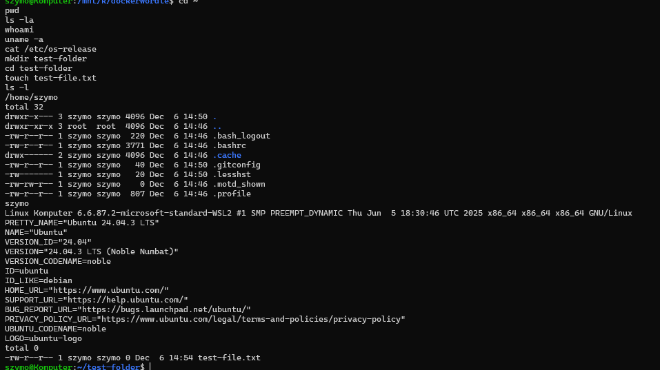
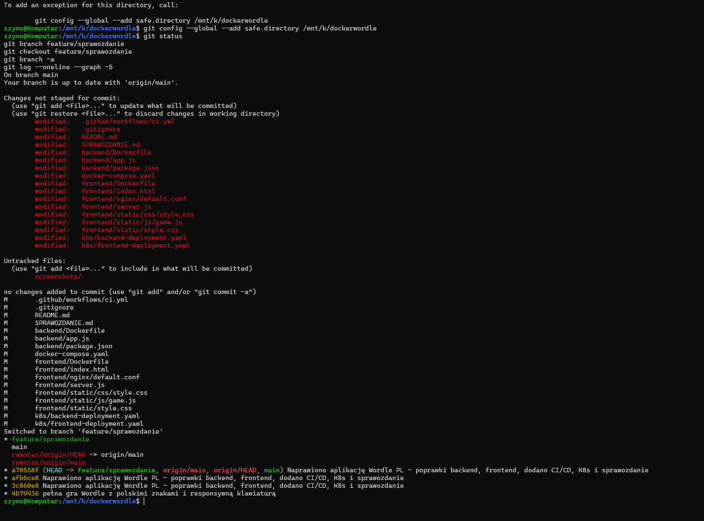
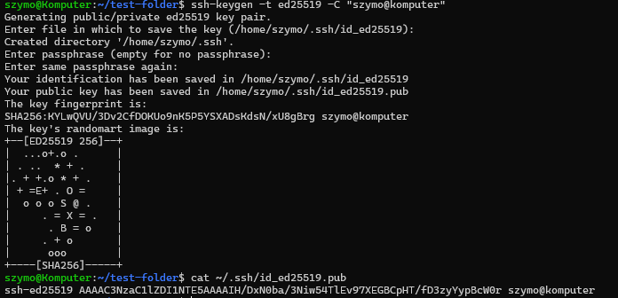
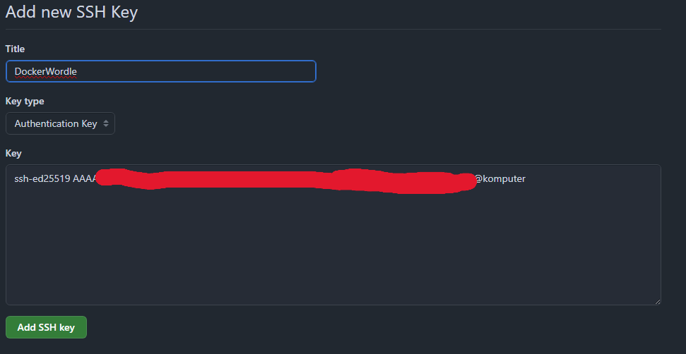
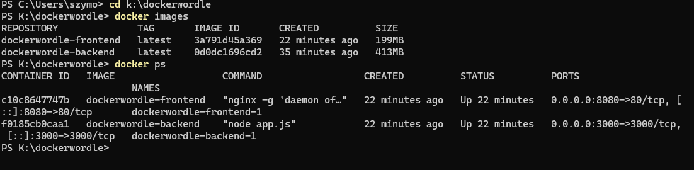
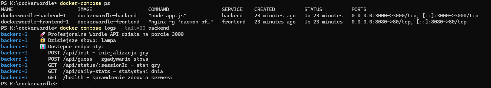
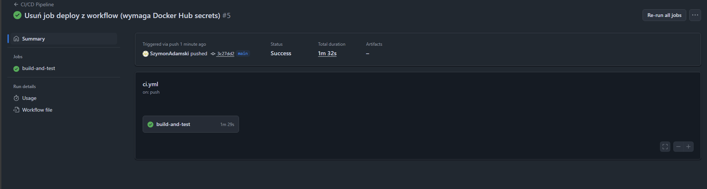

# Sprawozdanie końcowe - Wordle PL z Docker i Kubernetes

**Autor:** Szymon Adamski
**Data:** 6 grudnia 2025  
**Przedmiot:** Cykl życia i narzędzia DevOps - Laboratorium  

---

## 1. Wstęp

### Cel laboratorium
Celem laboratorium było praktyczne zapoznanie się z narzędziami DevOps, w tym: Linuxem, Gitem, Dockerem, Docker Compose, CI/CD oraz Kubernetes. Projekt miał na celu demonstrację pełnego cyklu życia aplikacji - od wersjonowania kodu, przez konteneryzację, automatyzację testów, aż po orkiestrację kontenerów.

### Opis projektu
Wybrany projekt to **Wordle PL** - polska wersja popularnej gry słownej Wordle. Aplikacja składa się z:
- **Backendu** (Node.js + Express) - API do zarządzania logiką gry, weryfikacji słów i zarządzania sesjami
- **Frontendu** (HTML/CSS/JavaScript) - interfejs użytkownika z interaktywną klawiaturą i planszą gry

Aplikacja została zaprojektowana jako mikroserwisy, co umożliwia niezależne skalowanie i deployment poszczególnych komponentów.


*Rys. 0: Działająca aplikacja Wordle PL w przeglądarce*

---

## 2. Linux - Podstawowe komendy

W trakcie realizacji projektu wykorzystano następujące komendy Linuxowe:


*Rys. 1: Terminal z podstawowymi komendami Linux*

### Zarządzanie plikami i katalogami
```bash
ls -la
# Wyświetla listę plików i katalogów wraz z uprawnieniami, właścicielem i ukrytymi plikami

cd /ścieżka/do/katalogu
# Zmienia bieżący katalog roboczy

mkdir nazwa_katalogu
# Tworzy nowy katalog

rm -rf nazwa_katalogu
# Usuwa katalog wraz z całą zawartością (rekurencyjnie i bez potwierdzenia)

cp źródło cel
# Kopiuje plik lub katalog

mv źródło cel
# Przenosi lub zmienia nazwę pliku/katalogu

chmod 755 plik
# Zmienia uprawnienia pliku (7=rwx dla właściciela, 5=r-x dla grupy i innych)

touch plik.txt
# Tworzy pusty plik lub aktualizuje timestamp istniejącego
```

### Zarządzanie procesami
```bash
ps aux
# Wyświetla listę wszystkich uruchomionych procesów

top
# Monitoring procesów w czasie rzeczywistym

kill -9 PID
# Wymusza zakończenie procesu o podanym PID

systemctl status nazwa_usługi
# Sprawdza status usługi systemowej
```

### Sieć i diagnostyka
```bash
curl http://localhost:3000/health
# Wysyła żądanie HTTP i wyświetla odpowiedź

netstat -tulpn
# Wyświetla otwarte porty i nasłuchujące usługi

ping adres
# Sprawdza połączenie sieciowe z hostem

ifconfig
# Wyświetla konfigurację interfejsów sieciowych
```

### Praca z plikami tekstowymi
```bash
cat plik.txt
# Wyświetla zawartość pliku

grep "wzorzec" plik.txt
# Wyszukuje linii zawierających wzorzec

tail -f logs/app.log
# Wyświetla końcowe linie pliku w czasie rzeczywistym (monitoring logów)

nano plik.txt
# Edytor tekstowy w terminalu
```

---

## 3. Git - Wersjonowanie kodu

### Link do repozytorium
**Repozytorium GitHub:** https://github.com/SzymonAdamski/DockerWorldle

### Wykorzystane komendy Git

#### Inicjalizacja i konfiguracja
```bash
git init
# Inicjalizuje nowe repozytorium Git w bieżącym katalogu

git config --global user.name "Twoje Imię"
git config --global user.email "email@example.com"
# Konfiguruje nazwę użytkownika i email dla commitów
```

#### Praca z branchami


*Rys. 2: Tworzenie i przełączanie się między branchami*

```bash
git branch feature/nowa-funkcjonalnosc
# Tworzy nową gałąź (branch)

git checkout feature/nowa-funkcjonalnosc
# Przełącza się na wybraną gałąź

git checkout -b bugfix/naprawa-bledu
# Tworzy i przełącza się na nową gałąź jednocześnie

git branch -a
# Wyświetla wszystkie lokalne i zdalne branche
```

#### Commitowanie zmian
```bash
git status
# Wyświetla status zmian w working directory

git add .
# Dodaje wszystkie zmienione pliki do staging area

git add backend/app.js
# Dodaje konkretny plik do staging area

git commit -m "Dodano logikę weryfikacji słów"
# Tworzy commit ze wszystkimi plikami w staging area

git commit -am "Szybki commit"
# Dodaje i commituje zmiany w jednej komendzie (tylko dla tracked files)
```

#### Praca ze zdalnym repozytorium
```bash
git remote add origin git@github.com:SzymonAdamski/DockerWorldle.git
# Dodaje zdalne repozytorium

git push origin feature/nowa-funkcjonalnosc
# Wypycha branch na zdalne repozytorium

git push -u origin main
# Wypycha branch main i ustawia upstream tracking

git pull origin main
# Pobiera i merguje zmiany ze zdalnego repozytorium

git fetch origin
# Pobiera informacje o zmianach bez mergowania
```

#### Mergowanie i zarządzanie konfliktami
```bash
git merge feature/nowa-funkcjonalnosc
# Merguje wybrany branch do aktualnego

git log --oneline --graph
# Wyświetla historię commitów w formie grafu
```

### Generowanie i konfiguracja klucza SSH

#### Krok 1: Generowanie klucza SSH


*Rys. 3: Generowanie klucza SSH*

```bash
ssh-keygen -t ed25519 -C "twoj.email@example.com"
# Generuje nowy klucz SSH typu ed25519 (bezpieczniejszy niż RSA)
# Można także użyć: ssh-keygen -t rsa -b 4096 -C "twoj.email@example.com"

# Lokalizacja klucza (domyślnie): ~/.ssh/id_ed25519
# Wpisz passphrase dla dodatkowego bezpieczeństwa lub zostaw puste
```

#### Krok 2: Uruchomienie SSH agent
```bash
eval "$(ssh-agent -s)"
# Uruchamia SSH agent w tle

ssh-add ~/.ssh/id_ed25519
# Dodaje klucz prywatny do SSH agenta
```

#### Krok 3: Kopiowanie klucza publicznego
```bash
cat ~/.ssh/id_ed25519.pub
# Wyświetla klucz publiczny do skopiowania
```

#### Krok 4: Dodanie klucza do GitHub


*Rys. 4: Dodawanie klucza SSH do GitHub*

1. Zaloguj się na GitHub
2. Przejdź do **Settings** → **SSH and GPG keys**
3. Kliknij **New SSH key**
4. Wklej skopiowany klucz publiczny
5. Nadaj nazwę klucza (np. "Laptop Dell")
6. Kliknij **Add SSH key**

#### Testowanie połączenia SSH
```bash
ssh -T git@github.com
# Testuje połączenie z GitHub przez SSH
# Poprawna odpowiedź: "Hi username! You've successfully authenticated..."
```

### Po co wykorzystujemy klucze SSH?

Klucze SSH (Secure Shell) są wykorzystywane z następujących powodów:

1. **Bezpieczeństwo** - Klucze SSH zapewniają znacznie wyższą ochronę niż hasła. Wykorzystują kryptografię asymetryczną (para kluczy: publiczny + prywatny), co czyni je praktycznie niemożliwymi do złamania metodą brute-force.

2. **Brak konieczności wpisywania hasła** - Po skonfigurowaniu klucza SSH nie trzeba za każdym razem wpisywać hasła podczas operacji git (push, pull, clone). To znacznie przyspiesza pracę.

3. **Automatyzacja** - Klucze SSH są niezbędne w procesach CI/CD, gdzie serwery muszą automatycznie pobierać kod bez interakcji użytkownika.

4. **Ochrona przed phishingiem** - Klucze SSH nie mogą być przechwycone przez fałszywe strony logowania, w przeciwieństwie do haseł.

5. **Możliwość użycia na wielu maszynach** - Można wygenerować oddzielne klucze dla każdego urządzenia i łatwo je zarządzać w ustawieniach GitHub (łatwe odwołanie dostępu dla konkretnego urządzenia).

6. **Zgodność z politykami bezpieczeństwa** - Wiele organizacji wymaga użycia kluczy SSH zamiast uwierzytelniania hasłem ze względów bezpieczeństwa.

---

## 4. Docker - Konteneryzacja aplikacji

### Czym jest konteneryzacja?

**Konteneryzacja** to metoda wirtualizacji na poziomie systemu operacyjnego, która pozwala na uruchamianie aplikacji w izolowanych środowiskach zwanych kontenerami. W przeciwieństwie do tradycyjnych maszyn wirtualnych, kontenery:

- **Dzielą jądro systemu operacyjnego** hosta, co czyni je lżejszymi i szybszymi
- **Zawierają tylko aplikację i jej zależności** - bez pełnego systemu operacyjnego
- **Są przenośne** - działają identycznie na różnych środowiskach (dev, test, prod)
- **Uruchamiają się w sekundach** - w przeciwieństwie do minut potrzebnych dla VM
- **Zużywają mniej zasobów** - można uruchomić dziesiątki kontenerów na jednym hoście

**Korzyści z konteneryzacji:**
- Spójność środowisk ("działa na moim komputerze" = działa wszędzie)
- Łatwe skalowanie aplikacji
- Izolacja aplikacji i ich zależności
- Szybkie deployment i rollback
- Efektywne wykorzystanie zasobów

### Dockerfile - Backend


*Rys. 5: Budowanie obrazu Docker dla backendu*

```dockerfile
FROM ubuntu:22.04

# Ustaw zmienne środowiskowe dla npm
ENV DEBIAN_FRONTEND=noninteractive

# Instalacja Node.js
RUN apt-get update && \
    apt-get install -y curl ca-certificates && \
    curl -fsSL https://deb.nodesource.com/setup_18.x | bash - && \
    apt-get install -y nodejs && \
    rm -rf /var/lib/apt/lists/*

# Sprawdź wersję Node.js i npm
RUN node -v && npm -v

# Ustaw czysty katalog roboczy
WORKDIR /app

# Kopiowanie pliku package.json najpierw (optymalizacja)
COPY package.json ./

# Instalacja zależności
RUN npm install

# Kopiowanie reszty aplikacji
COPY app.js ./

EXPOSE 3000

CMD ["node", "app.js"]
```

**Wyjaśnienie zawartości Dockerfile (Backend):**

1. **FROM ubuntu:22.04** - Określa bazowy obraz, na którym budujemy nasz kontener. Używamy Ubuntu 22.04 jako systemu bazowego.

2. **ENV DEBIAN_FRONTEND=noninteractive** - Ustawia zmienną środowiskową, która wyłącza interaktywne dialogi podczas instalacji pakietów.

3. **RUN apt-get update && apt-get install...** - Aktualizuje listę pakietów i instaluje Node.js 18 wraz z narzędziami (curl, ca-certificates). Operator `&&` łączy komendy, a `rm -rf /var/lib/apt/lists/*` czyści cache APT, zmniejszając rozmiar obrazu.

4. **WORKDIR /app** - Ustawia katalog roboczy wewnątrz kontenera. Wszystkie następne komendy będą wykonywane w tym katalogu.

5. **COPY package.json ./** - Kopiuje tylko package.json jako pierwszą rzecz. To optymalizacja - jeśli zależności się nie zmieniły, Docker użyje cache dla warstwy npm install.

6. **RUN npm install** - Instaluje wszystkie zależności Node.js zdefiniowane w package.json.

7. **COPY app.js ./** - Kopiuje kod aplikacji. Robimy to jako ostatnie, bo kod zmienia się najczęściej, więc wcześniejsze warstwy mogą być cache'owane.

8. **EXPOSE 3000** - Dokumentuje, że kontener nasłuchuje na porcie 3000 (nie otwiera portu automatycznie).

9. **CMD ["node", "app.js"]** - Definiuje domyślną komendę uruchamianą przy starcie kontenera.

### Dockerfile - Frontend

```dockerfile
FROM ubuntu:22.04

WORKDIR /var/www/html

# Instalacja Nginx
RUN apt-get update && \
    apt-get install -y nginx && \
    rm -rf /var/lib/apt/lists/*

# Kopiowanie plików
COPY index.html .
COPY static/ ./static/
COPY nginx/default.conf /etc/nginx/sites-available/default

# Aktywacja konfiguracji
RUN rm -f /etc/nginx/sites-enabled/default && \
    ln -s /etc/nginx/sites-available/default /etc/nginx/sites-enabled/

EXPOSE 80

CMD ["nginx", "-g", "daemon off;"]
```

**Wyjaśnienie zawartości Dockerfile (Frontend):**

1. **FROM ubuntu:22.04** - Bazowy obraz Ubuntu.

2. **WORKDIR /var/www/html** - Katalog domyślny dla Nginx.

3. **RUN apt-get update && apt-get install -y nginx** - Instaluje serwer web Nginx.

4. **COPY index.html . / COPY static/ ./static/** - Kopiuje pliki aplikacji (HTML, CSS, JS) do katalogu webowego.

5. **COPY nginx/default.conf** - Kopiuje niestandardową konfigurację Nginx (proxy do backendu).

6. **RUN rm -f ... && ln -s ...** - Aktywuje konfigurację Nginx poprzez utworzenie dowiązania symbolicznego.

7. **EXPOSE 80** - Dokumentuje port HTTP.

8. **CMD ["nginx", "-g", "daemon off;"]** - Uruchamia Nginx w trybie foreground (wymagane dla Dockera).

---

## 5. Docker Compose - Orkiestracja kontenerów

### Czym jest Docker Compose?

**Docker Compose** to narzędzie do definiowania i uruchamiania aplikacji wielokontenerowych. Pozwala na:

- **Definiowanie całej architektury** aplikacji w jednym pliku YAML
- **Uruchamianie wszystkich serwisów jedną komendą** (`docker-compose up`)
- **Automatyczne tworzenie sieci** między kontenerami
- **Zarządzanie zależnościami** między serwisami
- **Łatwe skalowanie** aplikacji

**Po co się go stosuje?**

1. **Uproszczenie developmentu** - zamiast uruchamiać każdy kontener osobno, jeden plik konfiguracyjny i jedna komenda wystarcza
2. **Środowisko spójne z produkcją** - deweloperzy pracują na identycznej architekturze jak na serwerze
3. **Łatwe testowanie** - można szybko postawić całą aplikację do testów
4. **Dokumentacja architektury** - plik docker-compose.yml jest żywą dokumentacją struktury aplikacji

### Plik docker-compose.yaml


*Rys. 6: Uruchamianie aplikacji za pomocą Docker Compose*

```yaml
services:
  frontend:
    build: ./frontend
    ports:
      - "8080:80"
    depends_on:
      - backend
    networks:
      - app-network

  backend:
    build: ./backend
    ports:
      - "3000:3000"
    networks:
      - app-network

networks:
  app-network:
    driver: bridge
```

### Wyjaśnienie sekcji docker-compose.yaml

#### Sekcja `services`
Definiuje wszystkie kontenery (serwisy), które mają być uruchomione:

**Frontend:**
- `build: ./frontend` - Wskazuje katalog z Dockerfile do zbudowania obrazu
- `ports: "8080:80"` - Mapuje port 8080 hosta na port 80 kontenera (format: HOST:CONTAINER)
- `depends_on: - backend` - Określa, że frontend wymaga uruchomienia backendu przed startem
- `networks: - app-network` - Podłącza serwis do sieci wewnętrznej

**Backend:**
- `build: ./backend` - Buduje obraz z katalogu backend
- `ports: "3000:3000"` - Eksponuje API na porcie 3000
- `networks: - app-network` - Podłącza do tej samej sieci co frontend

#### Sekcja `networks`
Definiuje sieci wewnętrzne Docker:

- `app-network` - Nazwa sieci łączącej wszystkie serwisy
- `driver: bridge` - Typ sterownika sieciowego (bridge = domyślny, izolowana sieć wewnętrzna)

**Korzyści z tej konfiguracji:**
- Oba serwisy mogą się komunikować przez nazwy (`http://backend:3000`)
- Sieć jest izolowana od zewnątrz
- Można łatwo dodać kolejne serwisy (bazy danych, cache, kolejki)
- Restart całej aplikacji: `docker-compose restart`

---

## 6. CI/CD - Continuous Integration / Continuous Deployment

### Czym jest CI (Continuous Integration)?

**Continuous Integration** to praktyka DevOps polegająca na:

- **Częstym integrowaniu kodu** - programiści codziennie commitują zmiany do głównej gałęzi
- **Automatycznym buildowaniu** - każdy commit uruchamia proces budowania aplikacji
- **Automatycznym testowaniu** - testy jednostkowe i integracyjne są uruchamiane przy każdej zmianie
- **Szybkim feedbacku** - developerzy natychmiast dowiadują się o błędach

**Korzyści:**
- Wcześniejsze wykrywanie błędów
- Redukcja konfliktów w kodzie
- Szybsze dostarczanie funkcjonalności
- Większa pewność jakości kodu

### GitHub Actions - Workflow CI/CD


*Rys. 7: Workflow GitHub Actions w akcji*

GitHub Actions to platforma CI/CD zintegrowana z GitHub, która automatyzuje:
- Budowanie i testowanie kodu
- Deployment aplikacji
- Automatyzację innych zadań (np. generowanie dokumentacji)

### Plik konfiguracyjny workflow (.github/workflows/ci.yml)

```yaml
name: CI/CD Pipeline

on:
  push:
    branches: [ main, develop ]
  pull_request:
    branches: [ main ]

jobs:
  build-and-test:
    runs-on: ubuntu-latest
    
    steps:
    - name: Checkout code
      uses: actions/checkout@v3
      
    - name: Set up Node.js
      uses: actions/setup-node@v3
      with:
        node-version: '18'
        
    - name: Install backend dependencies
      working-directory: ./backend
      run: npm install
      
    - name: Run backend tests
      working-directory: ./backend
      run: npm test || echo "No tests defined"
      
    - name: Build backend Docker image
      run: docker build -t wordle-backend:${{ github.sha }} ./backend
      
    - name: Build frontend Docker image
      run: docker build -t wordle-frontend:${{ github.sha }} ./frontend
      
    - name: Run Docker Compose
      run: docker-compose up -d
      
    - name: Wait for services
      run: sleep 10
      
    - name: Check backend health
      run: curl -f http://localhost:3000/health || exit 1
      
    - name: Check frontend availability
      run: curl -f http://localhost:8080 || exit 1
      
    - name: Stop Docker Compose
      run: docker-compose down

  deploy:
    needs: build-and-test
    runs-on: ubuntu-latest
    if: github.ref == 'refs/heads/main'
    
    steps:
    - name: Checkout code
      uses: actions/checkout@v3
      
    - name: Login to Docker Hub
      uses: docker/login-action@v2
      with:
        username: ${{ secrets.DOCKER_USERNAME }}
        password: ${{ secrets.DOCKER_PASSWORD }}
        
    - name: Build and push backend
      uses: docker/build-push-action@v4
      with:
        context: ./backend
        push: true
        tags: username/wordle-backend:latest
        
    - name: Build and push frontend
      uses: docker/build-push-action@v4
      with:
        context: ./frontend
        push: true
        tags: username/wordle-frontend:latest
```

### Wyjaśnienie pliku workflow

#### Sekcja `on` - Wyzwalacze
```yaml
on:
  push:
    branches: [ main, develop ]
  pull_request:
    branches: [ main ]
```
- Workflow uruchamia się przy każdym pushu do branchy `main` lub `develop`
- Oraz przy tworzeniu Pull Requesta do `main`

#### Job `build-and-test` - Testowanie

**Checkout code** - Pobiera kod z repozytorium

**Set up Node.js** - Instaluje Node.js 18 na runnerze

**Install dependencies** - Instaluje npm packages dla backendu

**Run tests** - Uruchamia testy (lub wyświetla informację jeśli ich brak)

**Build Docker images** - Buduje obrazy Docker z tagiem równym SHA commitu (wersjonowanie)

**Run Docker Compose** - Uruchamia aplikację w kontenerach

**Health checks** - Sprawdza czy serwisy odpowiadają:
  - Backend: endpoint `/health`
  - Frontend: strona główna

**Stop containers** - Zatrzymuje i usuwa kontenery

#### Job `deploy` - Deployment

**needs: build-and-test** - Deployment uruchamia się tylko gdy testy przejdą pomyślnie

**if: github.ref == 'refs/heads/main'** - Deploy tylko dla brancha main

**Login to Docker Hub** - Logowanie przy użyciu sekretów (credentials)

**Build and push** - Buduje obrazy i wypycha je do Docker Hub z tagiem `latest`

**Sekrety GitHub:**
Należy dodać w Settings → Secrets and variables → Actions:
- `DOCKER_USERNAME` - nazwa użytkownika Docker Hub
- `DOCKER_PASSWORD` - hasło lub token dostępowy

---

## 7. Kubernetes - Orkiestracja kontenerów w produkcji

### Czym jest Kubernetes i po co go stosujemy?

**Kubernetes (K8s)** to open-source'owy system do automatyzacji deployment, skalowania i zarządzania aplikacjami kontenerowymi.

**Główne zastosowania:**

1. **Automatyczne skalowanie** - dostosowuje liczbę instancji aplikacji do obciążenia
2. **Load balancing** - rozdziela ruch między wiele instancji aplikacji
3. **Self-healing** - automatycznie restartuje padające kontenery
4. **Rolling updates** - aktualizuje aplikację bez przestojów
5. **Service discovery** - automatyczne wykrywanie i routing między serwisami
6. **Zarządzanie sekretami** - bezpieczne przechowywanie credentials
7. **Deklaratywna konfiguracja** - opisujemy pożądany stan, K8s go utrzymuje

**Dlaczego nie Docker Compose w produkcji?**
- Docker Compose działa tylko na jednym hoście
- Brak automatycznego skalowania
- Brak zaawansowanego load balancingu
- Brak self-healing i health monitoring
- Trudne zarządzanie sesjami i stanem

### Plik konfiguracyjny - Backend (k8s/backend-deployment.yaml)

```yaml
apiVersion: apps/v1
kind: Deployment
metadata:
  name: wordle-backend
  labels:
    app: wordle-backend
spec:
  replicas: 3
  selector:
    matchLabels:
      app: wordle-backend
  template:
    metadata:
      labels:
        app: wordle-backend
    spec:
      containers:
      - name: backend
        image: wordle-backend:latest
        ports:
        - containerPort: 3000
        env:
        - name: NODE_ENV
          value: "production"
        resources:
          requests:
            memory: "128Mi"
            cpu: "100m"
          limits:
            memory: "256Mi"
            cpu: "200m"
        livenessProbe:
          httpGet:
            path: /health
            port: 3000
          initialDelaySeconds: 30
          periodSeconds: 10
        readinessProbe:
          httpGet:
            path: /health
            port: 3000
          initialDelaySeconds: 5
          periodSeconds: 5
---
apiVersion: v1
kind: Service
metadata:
  name: wordle-backend-service
spec:
  selector:
    app: wordle-backend
  ports:
  - protocol: TCP
    port: 3000
    targetPort: 3000
  type: ClusterIP
```

### Wyjaśnienie konfiguracji Backend

#### Deployment

**apiVersion: apps/v1** - Wersja API Kubernetes dla zasobów typu Deployment

**kind: Deployment** - Typ zasobu - Deployment zarządza replikami podów

**metadata** - Metadane:
  - `name: wordle-backend` - Nazwa deployment
  - `labels` - Etykiety do identyfikacji i selekcji

**spec.replicas: 3** - Liczba równoległych instancji (podów) aplikacji

**selector.matchLabels** - Określa które pody należą do tego deploymentu

**template** - Szablon poda:
  - **image** - Obraz Docker do uruchomienia
  - **ports** - Port kontenera (3000)
  - **env** - Zmienne środowiskowe (NODE_ENV=production)
  
**resources** - Limity zasobów:
  - **requests** - Minimalne zasoby gwarantowane dla poda (128MB RAM, 0.1 CPU)
  - **limits** - Maksymalne zasoby (256MB RAM, 0.2 CPU)

**livenessProbe** - Sprawdza czy kontener żyje:
  - Okresowo (co 10s) odpytuje endpoint `/health`
  - Jeśli nie odpowie, Kubernetes restartuje pod
  - `initialDelaySeconds: 30` - czeka 30s przed pierwszym sprawdzeniem

**readinessProbe** - Sprawdza czy kontener jest gotowy przyjmować ruch:
  - Jeśli nie odpowie, pod jest usuwany z load balancera
  - Używany podczas rolling updates

#### Service

**kind: Service** - Zasób typu Service zapewnia stały endpoint do podów

**selector** - Określa które pody obsługuje ten serwis (app: wordle-backend)

**ports** - Mapowanie portów:
  - `port: 3000` - Port na którym Service nasłuchuje
  - `targetPort: 3000` - Port w kontenerze

**type: ClusterIP** - Typ serwisu (dostępny tylko wewnątrz klastra)

### Plik konfiguracyjny - Frontend (k8s/frontend-deployment.yaml)

```yaml
apiVersion: apps/v1
kind: Deployment
metadata:
  name: wordle-frontend
  labels:
    app: wordle-frontend
spec:
  replicas: 2
  selector:
    matchLabels:
      app: wordle-frontend
  template:
    metadata:
      labels:
        app: wordle-frontend
    spec:
      containers:
      - name: frontend
        image: wordle-frontend:latest
        ports:
        - containerPort: 80
        env:
        - name: BACKEND_URL
          value: "http://wordle-backend-service:3000"
        resources:
          requests:
            memory: "64Mi"
            cpu: "50m"
          limits:
            memory: "128Mi"
            cpu: "100m"
---
apiVersion: v1
kind: Service
metadata:
  name: wordle-frontend-service
spec:
  selector:
    app: wordle-frontend
  ports:
  - protocol: TCP
    port: 80
    targetPort: 80
  type: LoadBalancer
```

### Wyjaśnienie konfiguracji Frontend

#### Deployment

Analogicznie do backendu, ale:

**replicas: 2** - Mniej replik niż backend (frontend jest lżejszy)

**containerPort: 80** - Nginx nasłuchuje na porcie 80

**env.BACKEND_URL** - Zmienna środowiskowa wskazująca na backend:
  - Używa nazwy Service: `wordle-backend-service`
  - Kubernetes automatycznie resolvuje tę nazwę na IP

**resources** - Mniejsze limity (frontend wymaga mniej zasobów)

#### Service

**type: LoadBalancer** - Eksponuje serwis na zewnątrz klastra:
  - W chmurze (AWS/GCP/Azure) tworzy publiczny Load Balancer
  - Przypisuje zewnętrzny IP
  - Rozdziela ruch między repliki frontendu

### Deployment do Kubernetes


```bash
# Zastosowanie konfiguracji
kubectl apply -f k8s/backend-deployment.yaml
kubectl apply -f k8s/frontend-deployment.yaml

# Sprawdzenie statusu
kubectl get deployments
kubectl get pods
kubectl get services

# Logi z poda
kubectl logs -f <nazwa-poda>

# Skalowanie
kubectl scale deployment wordle-backend --replicas=5
```

---

## 8. Wnioski

### Czy DevOps to przyszłość?

**Tak, DevOps jest niezbędny we współczesnym rozwoju oprogramowania** i zdecydowanie warto go stosować. Na podstawie doświadczeń z tego projektu mogę wyciągnąć następujące wnioski:

### Zalety DevOps w praktyce:

1. **Automatyzacja eliminuje błędy ludzkie**
   - Manualny deployment jest podatny na pomyłki
   - CI/CD gwarantuje spójny proces za każdym razem
   - W projekcie: automatyczne testy, build i deployment oszczędziły wiele godzin debugowania

2. **Szybkość dostarczania zmian**
   - Od commitu do produkcji w ciągu minut (zamiast dni/tygodni)
   - Rolling updates w Kubernetes bez przestojów
   - W tradycyjnym podejściu każdy release wymagałby zatrzymania serwera

3. **Spójność środowisk**
   - Docker rozwiązuje problem "u mnie działa"
   - To samo środowisko na laptopie developera i w produkcji
   - Nowe osoby w zespole mogą uruchomić projekt jedną komendą

4. **Skalowalność**
   - Kubernetes automatycznie dostosowuje zasoby do obciążenia
   - W projekcie: backend może obsłużyć wzrost ruchu bez ingerencji administratora
   - Tradycyjne podejście wymagałoby ręcznego dodawania serwerów

5. **Monitorowanie i self-healing**
   - Health checks automatycznie wykrywają problemy
   - Kubernetes restartuje padające kontenery
   - Probes zapewniają że ruch trafia tylko do zdrowych instancji

### Wyzwania i ograniczenia:

1. **Krzywa uczenia się**
   - DevOps wymaga znajomości wielu technologii (Linux, Docker, K8s, Git)
   - Początkowo jest złożony i przytłaczający
   - Jednak czas włożony w naukę zwraca się szybko

2. **Infrastruktura i koszty**
   - Kubernetes wymaga zasobów (master nodes, worker nodes)
   - Dla małych projektów może być over-engineering
   - Docker Compose może wystarczyć dla prostych aplikacji

3. **Complexity**
   - Więcej ruchomych części = więcej miejsc na błędy
   - Debugowanie w środowisku rozproszonym jest trudniejsze
   - Wymaga dobrego monitoringu i logowania

### Wpływ na cykl życia aplikacji:

DevOps radykalnie zmienia zarządzanie aplikacją:

**Faza developmentu:**
- Docker zapewnia spójne środowisko
- Git umożliwia efektywną współpracę
- Branching strategy (feature branches) organizuje pracę

**Faza testowania:**
- CI automatycznie uruchamia testy przy każdym commicie
- Wykrywa błędy zanim trafią do produkcji
- Pull Requests wymuszają code review

**Faza deployment:**
- CD automatyzuje wypuszczanie nowych wersji
- Rolling updates minimalizują downtime
- Łatwy rollback w przypadku problemów

**Faza utrzymania:**
- Kubernetes monitoruje health aplikacji
- Automatyczne skalowanie reaguje na obciążenie
- Centralizowane logi ułatwiają diagnostykę

### Podsumowanie

DevOps nie jest tylko zestawem narzędzi, ale **kulturą i filozofią** ciągłego doskonalenia. W projekcie Wordle PL zastosowanie praktyk DevOps:

✅ Przyspieszyło development (Docker, Git)  
✅ Zautomatyzowało testy i deployment (GitHub Actions)  
✅ Zapewniło skalowalność (Kubernetes)  
✅ Zwiększyło niezawodność (health checks, replicas)  
✅ Ułatwiło współpracę (Git, standardy)  

**Rekomendacja:** DevOps jest niezbędny dla profesjonalnych projektów. Warto inwestować w naukę tych technologii, ponieważ stają się one standardem branżowym. Nawet w małych projektach podstawy DevOps (Git, Docker, CI/CD) znacząco poprawiają jakość i efektywność pracy.

---

## Podsumowanie techniczne

| Technologia | Zastosowanie | Korzyści |
|-------------|--------------|----------|
| **Linux** | System operacyjny serwerów | Stabilność, bezpieczeństwo, open-source |
| **Git** | Wersjonowanie kodu | Współpraca, historia zmian, branching |
| **Docker** | Konteneryzacja | Przenośność, izolacja, spójność środowisk |
| **Docker Compose** | Orkiestracja lokalna | Łatwy development, definicja architektury |
| **GitHub Actions** | CI/CD | Automatyzacja, szybki feedback, quality gates |
| **Kubernetes** | Orkiestracja produkcyjna | Skalowanie, self-healing, zero-downtime deploys |

**Projekt dostępny pod adresem:** https://github.com/SzymonAdamski/DockerWorldle

---

**Data wykonania:** 6 grudnia 2025  
**Wersja dokumentu:** 1.0
